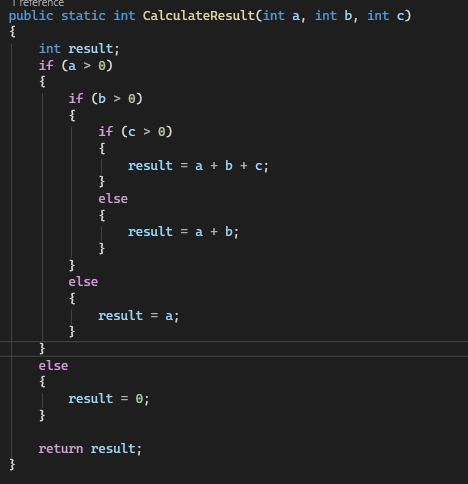
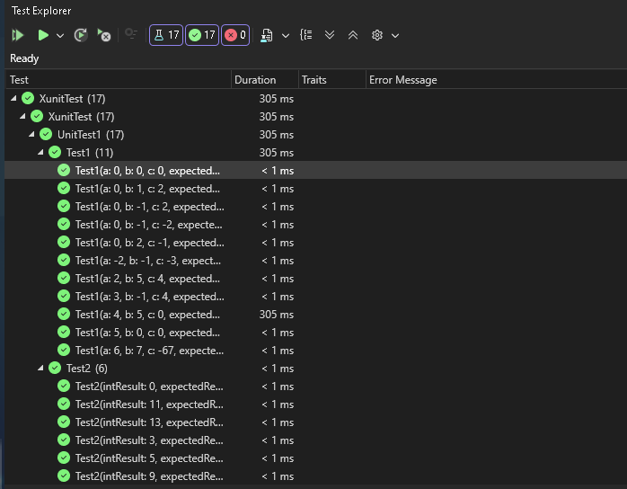
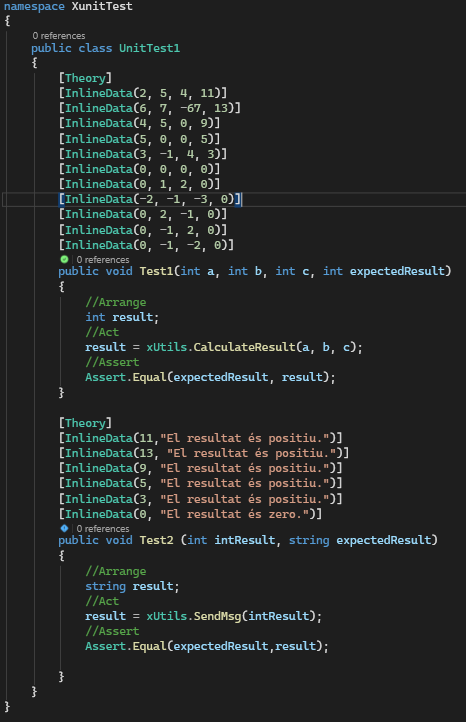

# Integració contínua i tests unitaris

Membres del grup

Carlos Morlás, Unai Almiñana, John De Vera, Camila Montes

## Pregunta 1: En aquest anàlisi inicial del programa, es mostren resultats en l’apartat de cobertura de codi (coverage)? Raoneu la vostra resposta, incloent una captura de la pantalla de resum de SonarCloud.

És perquè encara que hagi pogut analitzar el codi, comptabilitzat que té 21 línies, no ha trobat cap prova per aquestes 21 línies, per això, no hi ha cobertura.

## Pregunta 2: Quines accions heu realitzat per reduir la complexitat ciclomàtica?  Raoneu la vostra resposta.

Hem tret diverses línies de codi, entre aquestes hi havien repetides o què estaven malament:

Afegit el ‘public’ davant de la classe
- Borrat de variables innecessàries i les seves declaracions corresponents (unusedVar, x, counter)
- Borrat de Console.WriteLine redundants a l'inici i al final del codi
- Borrat de línies de codi antigues comentades
- Borrat de condicions, bucles i altres línies innecessàries dins les peticions del client.

Dins el codi, les condicions estan construïdes d’una manera que existeixen casos pels quals no podran passar mai, el codi no podrà printar mai l’opció que els valors siguin negatius, ja que les primeres condicions ho impedeixen.

## Pregunta 3: Com separaríeu la lògica de càlcul en mètodes independents?  Raoneu la vostra resposta.

Faríem un mètode per calcular el resultat fent ús de les condicions del programa i què el retorni, en el codi principal posem un switch case, en el qual depenent del resultat mostrarà el missatge corresponent.

## Pregunta 4: Es poden passar tots els tests correctament? Com es captura la sortida per consola? Raoneu la vostra resposta i poseu algun exemple on ho heu implementat.

S’han passat 18 tests correctament i han hagut 0 problemes.

## Pregunta 5: Quin error ha estat més difícil/complex de solucionar? Raoneu la vostra resposta i poseu algun exemple on ho heu implementat.

Havent acabat els anteriors exercicis, hem arribat a la conclusió que el problema més complex a solucionar va ser el coverage en poder corregir el codi, ja que tenim pocs coneixements sobre SonarCloud, per sort vam poder trobar informació sobre perquè ens sortia 0% de coverage, la raó era perquè no hi podia fer un test per verificar el programa.

| TC#  | Classe   | Nom del cas de Prova                                                               | Descripció                                                                           | Entrada                    | Accions                                                          | Resultat Esperat                                           | Resultat Obtingut                 | Tipus de cas |
|------|----------|------------------------------------------------------------------------------------|--------------------------------------------------------------------------------------|----------------------------|------------------------------------------------------------------|------------------------------------------------------------|-----------------------------------|--------------|
| TC1  | Classe 1 | Verificar resultat amb totes les variable majors a 0.                              | Tots els números són majors a 0                                                      | a = 2 b = 5 c = 4    | a > 0, b > 0 i c > 0 el resultat és a + b + c. 2 + 5 + 4 = 11 | Resultat > 0 -> True Mostra: ""El resultat és positiu"" | El resultat obtingut és correcte. | Cas normal   |
| TC2  | Classe 2 | Verificar resultat amb la variable a i b majors a 0.                               | La variable a i la variable b són números enters, però la variable c és menor què 0. | a = 6 b = 7 c = -67  | a > 0, b > 0 i c <= 0 el resultat és a + b. 6 + 7 = 13        | Resultat > 0 -> True Mostra: ""El resultat és positiu"" | El resultat obtingut és correcte. | Cas normal   |
| TC3  | Classe 2 | Verificar resultat amb la variable a i b majors a 0 i la c és igual a 0            | La variable a i la variable b són números enters, però la variable c és igual què 0. | a = 4 b = 5 c = 0    | a > 0, b > 0 i c <= 0 el resultat és a + b. 4 + 5 = 9         | Resultat > 0 -> True Mostra: ""El resultat és positiu"" | El resultat obtingut és correcte. | Cas límit    |
| TC4  | Classe 3 | Verificar variable és número enter                                                 | Només la variable a és número enter.                                                 | a = 5 b = 0 c = 0    | a > 0 i b ≤ 0, el resultat és a. Resultat = 5                 | Resultat > 0 -> True Mostra: ""El resultat és positiu"" | El resultat obtingut és correcte. | Cas límit    |
| TC6  | Classe 3 | Verificar las variables són números enters.                                        | La variable a i la variable c són números enters.                                    | a = 3 b = -1 c = 4   | a > 0 i b ≤ 0, però c > 0, el resultat és a. Resultat = 3     | Resultat > 0 -> True Mostra: ""El resultat és positiu"" | El resultat obtingut és correcte. | Cas normal   |
| TC7  | Classe 4 | Verificar la variable és número 0                                                  | La variable a és igual a 0.                                                          | a = 0 b = 0 c = 0    | a <= 0 el resultat és 0. Resultat = 0                         | Resultat = 0 -> True Mostra: ""El resultat és zero""    | El resultat obtingut és correcte. | Cas límit    |
| TC8  | Classe 4 | Verificar la variable és número 0 con el resto de variables mayor a 0              | La variable a és igual a 0, però la resta de variables són majors a 0.               | a = 0 b = 1 c = 2    | a <= 0 el resultat és 0. Resultat = 0                         | Resultat = 0 -> True Mostra: ""El resultat és zero""    | El resultat obtingut és correcte. | Cas límit    |
| TC9  | Classe 4 | Verificar la variable és número 0 con el resto de variables a 0                    | Totes les variables són menors a 0.                                                  | a = -2 b = -1 c = -3 | a <= 0 el resultat és 0. Resultat = 0                         | Resultat = 0 -> True Mostra: ""El resultat és zero""    | El resultat obtingut és correcte. | Cas normal   |
| TC10 | Classe 4 | Verificar variable amb la variable a és igual a 0, la c menor a 0 i la b major a 0 | La variable a és igual a 0,  b és major a 0 i c és menor a 0.                        | a = 0 b = 2 c = -1   | a <= 0 el resultat és 0. Resultat = 0                         | Resultat = 0 -> True Mostra: ""El resultat és zero""    | El resultat obtingut és correcte. | Cas límit    |
| TC11 | Classe 4 | Verificar variable amb la variable a és igual a 0, la b menor a 0 i la c major a 0 | La variable a és igual a 0,  c és major a 0 i b és menor a 0.                        | a = 0 b = -1 c = 2   | a <= 0 el resultat és 0. Resultat = 0                         | Resultat = 0 -> True Mostra: ""El resultat és zero""    | El resultat obtingut és correcte. | Cas límit    |
| TC12 | Classe 4 | Verificar variable amb la variable a és igual a 0 i la resta menor a 0.            | La variable a és igual a 0, la resta de variables són menors a 0.                    | a =0 b =-1 c =-2     | a <= 0 el resultat és 0. Resultat = 0                         | Resultat = 0 -> True Mostra: ""El resultat és zero""    | El resultat obtingut és correcte. | Cas límit    |
